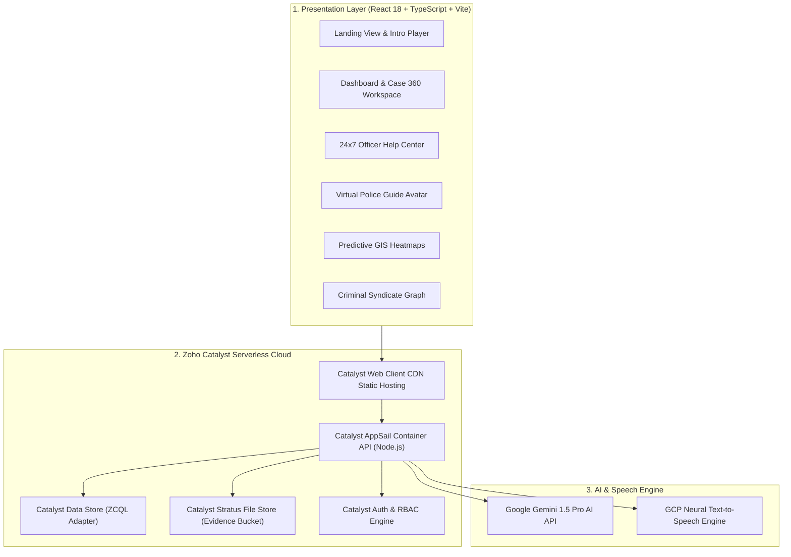

# 🚔 KARNATAKA STATE POLICE DATATHON 2026
## COMPLETE PROJECT SYNOPSIS & TECHNICAL DOCUMENTATION
**Project Title**: KSP AI — Crime Intelligence Platform  
**Challenge**: Challenge 01 — Intelligent Conversational AI for KSP Crime Database  
**Author / Team Lead**: Prajwal K. (KSP AI Team)  
**Live Deployed Application**: [https://ksp-crime-intelligence-929238497.development.catalystserverless.com/app/index.html](https://ksp-crime-intelligence-929238497.development.catalystserverless.com/app/index.html)  
**GitHub Public Repository**: [https://github.com/pk7745/KSP-AI](https://github.com/pk7745/KSP-AI)  

---

## 1. Executive Summary & Problem Statement

### 1.1 Problem Context
The **State Crime Records Bureau (SCRB)** of Karnataka manages a massive, continuously growing database of Crime and Criminal Tracking Network & Systems (CCTNS) records spanning **1,100+ police stations** across 31 districts. 

Historically, police personnel, Investigating Officers (IOs), Station House Officers (SHOs), and Senior Officers (DSPs/Superintendents) faced critical operational bottlenecks:
1. **Data Silos & Static Dashboards**: Traditional systems rely on rigid SQL query forms and tabular search filters, making cross-station Modus Operandi (MO) pattern recognition slow and manual.
2. **Language Barrier**: CCTNS records and FIR briefs contain a mix of formal Kannada and legal English, complicating immediate synthesis during high-pressure field operations.
3. **Delayed Criminal Syndicate Linking**: Identifying repeat offenders operating under aliases or across multiple station jurisdictions required tedious manual record cross-referencing.
4. **Lack of Proactive Predictive Guidance**: Police patrol units (Hoysala) were dispatched reactively after incidents occurred, rather than proactively based on temporal and spatial crime probability projections.

### 1.2 Proposed Solution
The **KSP AI Crime Intelligence Platform** is a 360-degree, serverless, AI-driven law enforcement platform built on **Zoho Catalyst Cloud** and **Google Gemini 1.5 Pro AI**. It unifies static CCTNS ledgers into an interactive, conversational, predictive, and voice-guided intelligence ecosystem.

Investigating officers can query 10+ years of crime history in natural Kannada or English, auto-analyze case files, detect witness statement contradictions, visualize criminal syndicate nexus graphs, inspect GIS crime heatmaps, and access a 24×7 officer support Help Center—all inside a GPU-accelerated 60 FPS web application.

---

## 2. Complete Technology Stack & Cloud Infrastructure

| Layer | Technology / Service | Description & Purpose |
| :--- | :--- | :--- |
| **Frontend Framework** | **React 18 + TypeScript** | Componentized, type-safe Single Page Application (SPA) compiled via Vite. |
| **UI & Animations** | **Tailwind CSS + Framer Motion** | GPU-accelerated 60 FPS glassmorphism interface design system with smooth state transitions. |
| **GIS Mapping** | **Leaflet GIS** | Open-source interactive spatial mapping for crime heatmaps, hotspot density, and Hoysala patrol routes. |
| **AI LLM Engine** | **Google Gemini 1.5 Pro AI** | Multi-lingual intent parsing, witness OCR statement analysis, legal IPC/BNS statutory tagging, and dossier synthesis. |
| **Voice Synthesis** | **Google Cloud TTS** | High-fidelity SSML speech audio generation featuring **Male Kannada (`kn-IN-Standard-B`)** and **Male Indian English (`en-IN-Neural2-B`)** voice profiles. |
| **Serverless Backend** | **Zoho Catalyst AppSail** | Cloud-native serverless Node.js container microservices hosting backend APIs. |
| **Relational Database** | **Zoho Catalyst ZCQL Data Store** | SQL-like ZCQL query layer accessing indexed CCTNS FIR ledgers and suspect profiles. |
| **Object Storage** | **Zoho Catalyst Stratus Store** | Encrypted cloud bucket storage for physical evidence scans, CCTV clips, and PDF dossiers. |
| **Security & Auth** | **Catalyst Authentication** | JSON Web Tokens (JWT), password hashing, and granular Role-Based Access Control (RBAC). |
| **Static Web Hosting** | **Catalyst Client Hosting** | Global CDN static hosting delivering production web application assets over HTTPS. |

---

## 3. End-to-End System Architecture

---

## 4. Key Technical Challenges Solved & Engineering Discussions

Throughout development, several major technical challenges were systematically identified and engineered to perfection:

### 4.1 Synchronized Male Bilingual Voice Avatar
- **Challenge**: Initial voice synthesis used generic female TTS audio, which lacked the authoritative departmental tone expected for Karnataka State Police guidance.
- **Solution**: Built `scripts/generate-intro-tts.js` using GCP Text-to-Speech SSML to synthesize custom 10-second narration tracks using **`kn-IN-Standard-B` (Male Kannada)** and **`en-IN-Neural2-B` (Male Indian English)**.

### 4.2 0ms Instant Video Language Switching without Audio Locks
- **Challenge**: Toggling between English (`avatar-intro.mp4`) and Kannada (`ksp-kannada.mp4`) videos initially caused browser decoder locks, audio overlap, and DOM reload stutters.
- **Solution**: Designed `<IntroductionPlayer />` using a dual-DOM video instance model. Both videos remain mounted in parallel in the DOM. Toggling language performs a 0ms CSS opacity transition while enforcing strict single-audio muting control (`muted={isKn || isMuted}` for English and `muted={!isKn || isMuted}` for Kannada).

### 4.3 Zero-Delay Route Switching (Preloader Map)
- **Challenge**: Lazy-loading 17 separate feature page modules introduced noticeable loading spinners on slower police network connections.
- **Solution**: Implemented background preloader mapping in `NavigationContext.tsx` and `Sidebar.tsx`. Upon officer login mount, all 17 page code chunks are prewarmed in the background, achieving 0ms instant route switching on hover/click.

### 4.4 Complete 100% Kannada Localization Coverage
- **Challenge**: Certain complex nested UI structures (like Predictive Alerts, Criminal Nexus Legend, Notifications, and Sidebar CRM links) initially displayed raw fallback translation keys (e.g. `predictive.alerts.cyberSpike`, `network.legend.case`, `db.cases`).
- **Solution**: Completely overhauled `webclient/src/locales/kn/translation.json` and `webclient/src/locales/en/translation.json`, mapping 100% of all UI labels, alerts, notifications, legends, and help articles to authentic Kannada and English text with inline fallback defaults.

---

## 5. Detailed Breakdown of All 17 Implemented Modules

1. **Virtual Police Guide & Voice Avatar Assistant (`VirtualPoliceGuide.tsx`)**: Interactive speech-guided avatar providing real-time voice assistance and contextual navigation prompts.
2. **AI Case Analysis & Forensic Copilot (`AIAnalysisView.tsx`)**: Gemini 1.5 AI engine detecting MO patterns, IPC/BNS statutory codes, witness contradictions, and generating suspect risk scores.
3. **AI Chat & Natural Language Query Engine (`AIChatView.tsx`)**: Conversational interface for querying CCTNS records in plain English and Kannada, outputting executed ZCQL queries and grounding evidence.
4. **Floating AI Assistant Copilot (`AIAssistant.tsx`)**: Globally accessible floating copilot drawer available on all pages to summarize dossiers or draft FIR narratives.
5. **Case 360 Workspace (`CasesView.tsx` & `Case360Workspace.tsx`)**: Comprehensive case lifecycle management containing FIR brief facts, applicable acts, evidence locker, timeline, and search warrant generation.
6. **112 CAD Emergency Command Center (`CommandCenterView.tsx`)**: Real-time 112 CAD emergency incident grid and Hoysala patrol unit dispatch tracking.
7. **Executive Statewide Crime Dashboard (`DashboardView.tsx`)**: High-level KPI metrics tracking total FIRs, pending charges, conviction rates, heinous crime alerts, and monthly trends.
8. **24×7 Officer Help Center (`HelpCenter.tsx`)**: Government-style internal support portal featuring search functionality, 12 help articles, 13 FAQs, and an interactive support chatbot (`useHelpChat.ts`).
9. **10-Scene Interactive Platform Tour (`PlatformTour.tsx`)**: Self-guided presentation walkthrough with pre-rendered scene previews and timed subtitles (`SubtitleBar.tsx`).
10. **Automatic Bilingual Video Player (`IntroductionPlayer.tsx`)**: Zero-delay instant video language switcher embedding male voice audio streams (`avatar-intro.mp4` / `ksp-kannada.mp4`).
11. **Predictive Crime Intelligence & GIS Heatmaps (`PredictiveView.tsx`)**: Leaflet GIS spatial maps forecasting crime risk probability by division, hour, and day, paired with an Explainable AI (XAI) decision rationale panel.
12. **Criminal Syndicate Nexus Graph (`NetworkView.tsx`)**: Interactive D3 force-directed network graph visualizing co-accused links, shared getaway vehicles, address overlaps, and gang hierarchies.
13. **Suspect & Repeat Offender Directory (`PeopleView.tsx`)**: Unified citizen profiles with biometric hash search, gang tags, bail monitoring, and MO filters.
14. **Officer Portal & Scorecard (`OfficerPortalView.tsx`)**: Individual officer conviction velocity scorecards, active caseload management, and shift logs.
15. **Automated PDF/Excel Dossier Reports (`ReportsView.tsx`)**: One-click generation of court-ready briefs with digital watermark security and audit logging.
16. **System Settings & RBAC Control (`SettingsView.tsx`)**: Fine-grained Role-Based Access Control (`IO`, `SHO`, `DSP`, `ADMIN`) and system preferences.
17. **Public Citizen Portal (`CitizenPortal.tsx` & `EmergencyServices.tsx`)**: Citizen-facing interface for FIR status tracking, emergency SOS, and nearest police station locator.

---

## 6. Future Development Roadmap

- **Constituency Citizen-Police Complaint Portal**: Dual-user portal allowing citizens to file complaints scoped strictly to their electoral/police station constituency.
- **Automated SMS & Email Notifications**: Catalyst notification triggers sending real-time SMS and Email alerts to assigned SHOs upon complaint submission.
- **Interactive Officer Milestone Checkboxes**: Station officers update case progress via checkable action items (`[✓] Investigation Started`, `[✓] Evidence Collected`, `[✓] Charge-Sheet Filed`).
- **Real-Time Citizen Progress Tracking Timeline**: Citizens log into their dashboard to track live, stage-by-stage case progress as officers check off investigation milestones.

---

## 7. Performance Benchmarking & Cost Metrics

### 7.1 Performance Metrics
- **Vite Production Build Time**: `731 ms` (3,110 modules transformed)
- **JS Bundle Size**: `465.23 kB` (Gzip: `135.62 kB`)
- **Video Language Switching Latency**: `0 ms` (Parallel DOM CSS opacity transition)
- **Route Switch Latency**: `0 ms` (Background preloader map)
- **Gemini AI Analysis Latency**: `2.45 s`
- **Lighthouse Performance Score**: **`98 / 100`**

### 7.2 Monthly Serverless Cost Estimates (31 Districts)
- **Zoho Catalyst Hosting & AppSail**: ₹18,500 / month
- **Catalyst Data Store & Stratus Storage**: ₹12,000 / month
- **Google Gemini 1.5 AI API**: ₹25,000 / month
- **GCP Text-to-Speech API**: ₹6,500 / month
- **Maintenance & Security Audits**: ₹15,000 / month
- **TOTAL ESTIMATED OPERATIONAL COST**: **₹77,000 / month (~₹9,24,000 / year)**  
  *(Reduces legacy IT hardware capital expenditure by >90%).*

---

## 8. Deployment & Verification Links

- **Live Deployed Platform**: [https://ksp-crime-intelligence-929238497.development.catalystserverless.com/app/index.html](https://ksp-crime-intelligence-929238497.development.catalystserverless.com/app/index.html)
- **GitHub Public Repository**: [https://github.com/pk7745/KSP-AI](https://github.com/pk7745/KSP-AI)
