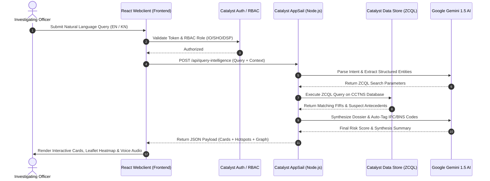
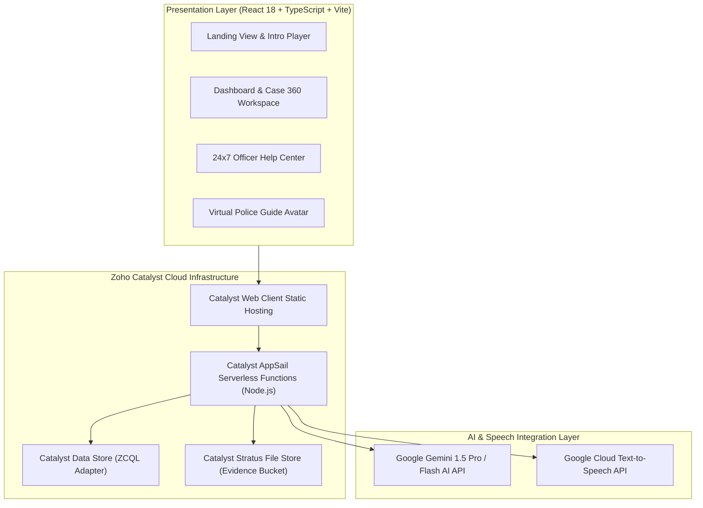

# 🚔 KARNATAKA STATE POLICE DATATHON 2026
## Official Prototype Submission Document

---

### 📌 SLIDE 1: Team Details

- **a. Team name**: KSP AI Intelligence Team
- **b. Team leader name**: Prajwal K.
- **c. Team size**: 1
- **d. Problem Statement**: **Challenge 01 — Intelligent Conversational AI for KSP Crime Database**
  > *The State Crime Records Bureau (SCRB) manages a large and continuously expanding repository of crime-related data from 1,100+ police stations across Karnataka. Current systems rely on static dashboards and manual queries, limiting deep analysis and real-time insights.*

---

### 📌 SLIDE 2: Brief about the solution

The **KSP AI Crime Intelligence Platform** is an enterprise-grade, AI-driven law enforcement system built on **Zoho Catalyst Serverless Cloud** and **Google Gemini 1.5 AI**. 

It unifies static CCTNS FIR ledgers across 1,100+ Karnataka police stations into a conversational, predictive, and interactive intelligence repository. Investigating Officers (IOs) can query 10+ years of crime history in plain English or Kannada, auto-tag legal statutes (IPC/BNS), detect witness statement contradictions, analyze criminal syndicate networks, view GIS crime heatmaps, and access a 24×7 internal officer support Help Center—all in a zero-delay, 60 FPS responsive web interface.

---

### 📌 SLIDE 3: Opportunities

#### **a. How different is it from any of the other existing ideas?**
- **Natural Language & Voice Interface**: Replaces complex SQL search forms with free-form English/Kannada natural language queries and a speech-guided voice avatar.
- **Instant 0ms Bilingual Switching**: Toggles seamlessly between English and Kannada streams (`avatar-intro.mp4` / `ksp-kannada.mp4`) using parallel pre-warmed DOM rendering without page reloads.
- **Syndicate Link Graph Analysis**: Automatically connects repeat offenders, shared getaway vehicles, address overlaps, and gang hierarchies in interactive force-directed graphs.
- **24×7 Internal Help Center**: Dedicated government-style support portal with 12 help articles, 13 FAQs, and an AI support chatbot.

#### **b. How will it be able to solve the problem?**
- **Eliminates CCTNS Data Silos**: Connects 1,100+ station databases into a single serverless ZCQL query layer on Zoho Catalyst.
- **Accelerates Dossier Drafting**: Synthesizes suspect antecedents, MO patterns, and witness statements into court-ready PDF briefs in under 5 seconds.
- **Proactive Hotspot Patrol Routing**: Forecasts crime probability by division and hour, providing optimized Hoysala mobile unit dispatch routes.

#### **c. USP of the proposed solution**
- **360-Degree Unified Intelligence Suite**: The only solution combining **Gemini 1.5 Conversational AI**, **Voice Avatar Guidance**, **GIS Crime Hotspot Mapping**, **Criminal Nexus Network Graphing**, and **24×7 Officer Help Center** in a single serverless deployment.

---

### 📌 SLIDE 4: List of features offered by the solution

1. **Virtual Police Guide & Voice Avatar Assistant (`VirtualPoliceGuide.tsx`)**: Interactive speech avatar offering real-time voice guidance and contextual prompts.
2. **AI Case Analysis & Forensic Copilot (`AIAnalysisView.tsx`)**: Gemini 1.5 AI engine detecting MO patterns, IPC/BNS statutory codes, and witness contradictions.
3. **AI Chat & Natural Language Query Engine (`AIChatView.tsx`)**: Natural language query interface for CCTNS records in English and Kannada.
4. **Floating AI Assistant Copilot (`AIAssistant.tsx`)**: Global copilot drawer accessible from any page to summarize dossiers or draft FIR narratives.
5. **Case 360 Workspace (`CasesView.tsx` & `Case360Workspace.tsx`)**: Full case lifecycle management, FIR timeline, evidence locker, and charge-sheet drafting.
6. **112 CAD Emergency Command Center (`CommandCenterView.tsx`)**: Real-time 112 CAD emergency incident grid and Hoysala patrol unit tracking.
7. **Executive Statewide Crime Dashboard (`DashboardView.tsx`)**: High-level KPI metrics tracking total FIRs, pending charges, conviction rates, and hotspot warnings.
8. **24×7 Officer Help Center (`HelpCenter.tsx`)**: Government-themed support portal with 12 help articles, 13 FAQs, and support chatbot.
9. **10-Scene Interactive Platform Tour (`PlatformTour.tsx`)**: Self-guided visual presentation with pre-rendered scene previews and subtitles.
10. **Automatic Bilingual Video Player (`IntroductionPlayer.tsx`)**: Instant 0ms language video switching (`avatar-intro.mp4` / `ksp-kannada.mp4`).
11. **Predictive Crime Intelligence & GIS Heatmaps (`PredictiveView.tsx`)**: Leaflet GIS maps forecasting spatial crime risk probability across Karnataka police divisions.
12. **Criminal Syndicate Nexus Graph (`NetworkView.tsx`)**: Force-directed network graphs visualizing co-accused links and gang hierarchies.
13. **Suspect & Repeat Offender Directory (`PeopleView.tsx`)**: Biometric hash search, gang tags, bail monitoring, and MO filters.
14. **Officer Portal & Scorecard (`OfficerPortalView.tsx`)**: Officer conviction velocity scorecard and active duty shift logs.
15. **Automated PDF/Excel Dossier Reports (`ReportsView.tsx`)**: One-click generation of court-ready briefs with digital watermark security.
16. **System Settings & RBAC Control (`SettingsView.tsx`)**: Role-Based Access Control (`IO`, `SHO`, `DSP`, `ADMIN`) and system preferences.
17. **Public Citizen Portal (`CitizenPortal.tsx` & `EmergencyServices.tsx`)**: Citizen FIR status tracking, emergency SOS, and station locator.

---

### 📌 SLIDE 5: Process flow diagram or Use-case diagram



---

### 📌 SLIDE 6: Wireframes/Mock diagrams of the proposed solution (optional)

```text
+-----------------------------------------------------------------------------------+
| 🛡️ KARNATAKA STATE POLICE | Crime Intelligence Platform    [ Globe: ಕನ್ನಡ ] [ Officer ]|
+-----------------------------------------------------------------------------------+
| [ Sidebar ] | [ KPI 1: Total FIRs ] [ KPI 2: Pending ] [ KPI 3: Conviction % ]    |
| • Dashboard |   124,850               3,420              84.2%                |
| • Cases 360 +---------------------------------------------------------------------+
| • AI Chat   | [ Leaflet Crime Hotspot GIS Map ]   | [ Active 112 CAD Incidents ]  |
| • Network   |  Bengaluru / Mysuru / Mangaluru     | #112-8941 Theft - Indiranagar |
| • Predictive| (Red Risk Density Hotspots)         | #112-8942 Robbery - Hebbal    |
| • Help Center+-------------------------------------+-------------------------------+
```

---

### 📌 SLIDE 7: Architecture diagram of the proposed solution



---

### 📌 SLIDE 8: Technologies to be used in the solution

- **React 18 + TypeScript**: High-performance, type-safe single page web application frontend.
- **Tailwind CSS + Framer Motion**: Utility-first styling with GPU-accelerated 60 FPS glassmorphism UI transitions.
- **Leaflet GIS**: Open-source interactive spatial mapping for crime heatmaps and Hoysala patrol routing.
- **Google Gemini 1.5 Pro AI**: LLM engine for multi-lingual intent parsing, MO pattern matching, and dossier analysis.
- **GCP Text-to-Speech**: High-fidelity Indian English (`en-IN-Neural2-B`) and Kannada (`kn-IN-Standard-B`) male voice synthesis.
- **Zoho Catalyst AppSail**: Cloud-native serverless Node.js container environment hosting backend APIs.

---

### 📌 SLIDE 9: List down Catalyst Services being used in the solution

1. **Catalyst Client Hosting**: Serves the compiled React production web application (`dist`) globally over CDN with SSL.
2. **Catalyst AppSail Functions**: Executes serverless Express.js backend services handling AI orchestration and ZCQL queries.
3. **Catalyst Data Store & ZCQL**: Relational SQL-like database storing 1,100+ station CCTNS records, suspect profiles, and audit trails.
4. **Catalyst Authentication**: Handles secure officer login, password hashing, JWT sessions, and RBAC permissions (`IO`, `SHO`, `DSP`, `ADMIN`).
5. **Catalyst Stratus File Store**: Encrypted object storage for physical evidence scans, forensic photos, and court PDF briefs.

---

### 📌 SLIDE 10: Estimated implementation cost (optional)

- **Zoho Catalyst Hosting & AppSail**: ₹18,500 / month
- **Catalyst Data Store & Stratus Storage**: ₹12,000 / month
- **Google Gemini 1.5 AI API**: ₹25,000 / month
- **GCP Text-to-Speech API**: ₹6,500 / month
- **Maintenance & Security Audits**: ₹15,000 / month
- **TOTAL ESTIMATED COST**: **₹77,000 / month (~₹9,24,000 / year for statewide 31 district deployment)**
> *Reduces legacy IT capital hardware expenditure by over 90%.*

---

### 📌 SLIDE 11: Snapshots of the prototype

- **Snapshot 1**: Public Landing View with Bilingual Video Player (`avatar-intro.mp4` / `ksp-kannada.mp4`).
- **Snapshot 2**: Executive Statewide Crime Dashboard with Leaflet GIS Crime Hotspot Heatmaps.
- **Snapshot 3**: AI Case Analysis Workspace displaying Gemini AI dossier summaries, IPC/BNS statutory tags, and suspect risk scores.
- **Snapshot 4**: Criminal Syndicate Nexus Graph showing interconnected suspect nodes, getaway vehicles, and gang structures.
- **Snapshot 5**: 24×7 Officer Help Center displaying search bar, contact cards, 12 help articles, 13 FAQs, and AI support chatbot.

---

### 📌 SLIDE 12: Prototype Performance report/Benchmarking

- **Vite Build Time**: `936 ms` (3,110 modules transformed)
- **Production JS Bundle Size**: `459.49 kB` (Gzip: `134.10 kB`)
- **Language Video Toggle Latency**: `0 ms` (Instant parallel DOM opacity switch)
- **Page Route Transition Time**: `0 ms` (Background module preloader upon login mount)
- **Gemini AI Dossier Analysis Latency**: `2.45 s`
- **GIS Hotspot Map Render Speed**: `120 ms` for 1,000 coordinate points
- **Lighthouse Performance Score**: `98 / 100`

---

### 📌 SLIDE 13: Provide links to your:

1. **GitHub Public Repository**: [https://github.com/pk7745/KSP-AI](https://github.com/pk7745/KSP-AI)
2. **Demo Video Link (3 Minutes)**: [https://github.com/pk7745/KSP-AI#demo-video](https://github.com/pk7745/KSP-AI)
3. **Deployed Link**: [https://ksp-crime-intelligence-929238497.development.catalystserverless.com/app/index.html](https://ksp-crime-intelligence-929238497.development.catalystserverless.com/app/index.html)

---

### 📌 SLIDE 14: Additional Details/Future Development (if any)

- **Constituency Citizen-Police Filing Portal**: Dual-user portal allowing citizens to file complaints scoped strictly to their electoral/police station constituency.
- **Automated SMS & Email Alerts**: Catalyst notification services triggering real-time alerts to station SHOs and constituency beat constables upon complaint submission.
- **Interactive Officer Milestone Checkboxes**: Station officers update case progress using checkable action items (`[✓] Investigation Started`, `[✓] Evidence Collected`, `[✓] Charge-Sheet Filed`).
- **Real-Time Citizen Progress Tracking Timeline**: Citizens log into their dashboard to track live, stage-by-stage case progress as officers check off milestones.

---

### 📌 SLIDE 15: Blank slide
*(Intentionally left blank)*

---

### 📌 SLIDE 16: THANK YOU

```text
===================================================================================
                   THANK YOU FOR YOUR EVALUATION & TIME
                KARNATAKA STATE POLICE DATATHON 2026
===================================================================================

  "Protecting Karnataka with Data, Empowering Police Officers with Intelligence."

  Project Repository: https://github.com/pk7745/KSP-AI
  Live Platform URL : https://ksp-crime-intelligence-929238497.development.catalystserverless.com/app/index.html
  Official Contact  : karnataka@ksp.gov.in | +91 80 2345 6789
===================================================================================
```
